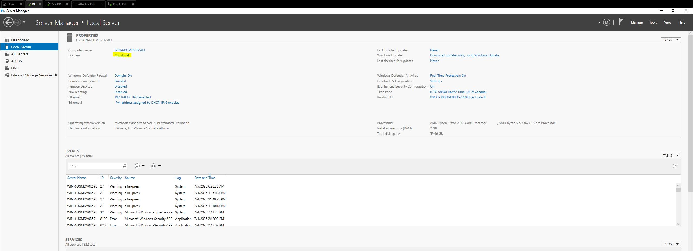
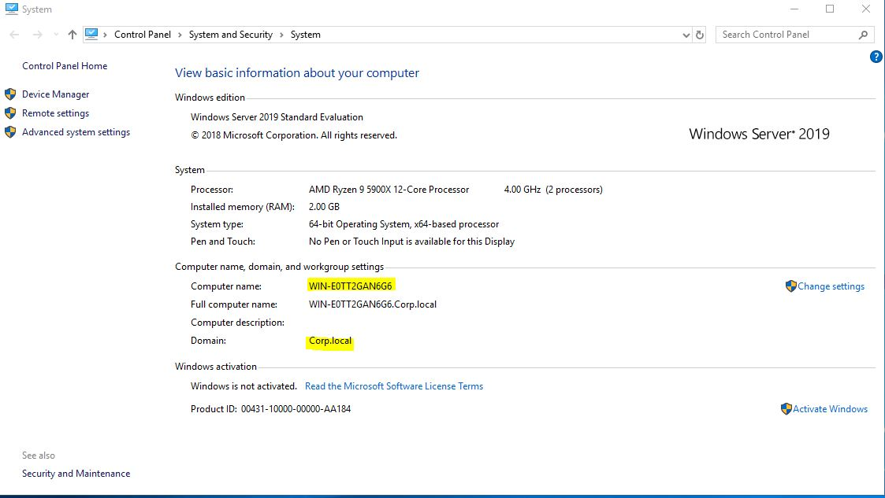
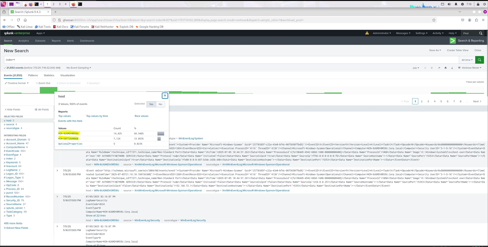
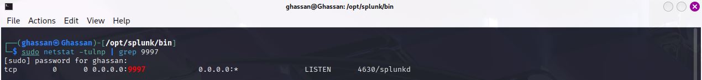
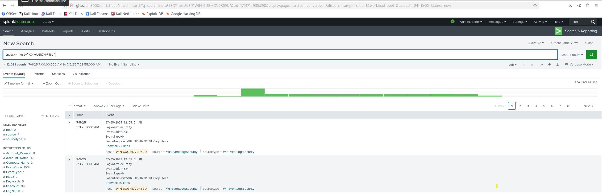
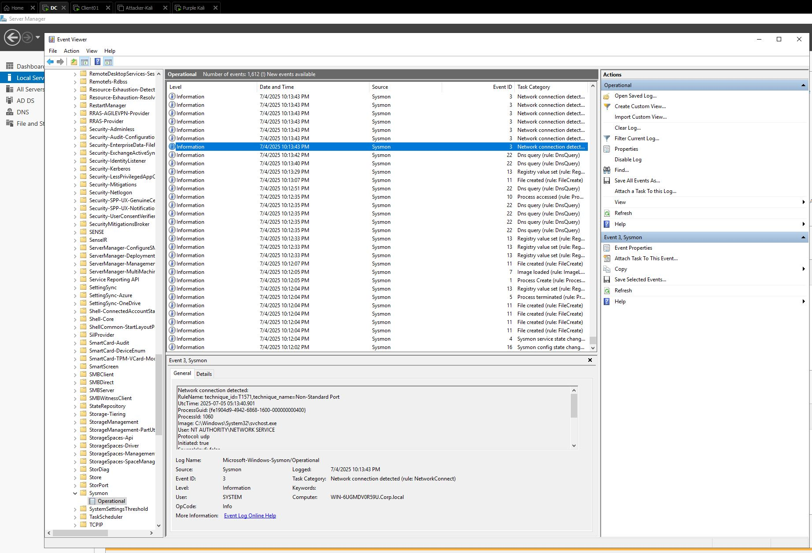

# 🛡️ SOC Lab: Windows Domain with Splunk

This is a home lab project to simulate a basic Security Operations Center (SOC) using Windows infrastructure and Splunk for centralized log collection.

---

## 🧰 Lab Components

| Component           | Description                                 |
|---------------------|---------------------------------------------|
| 🖥️ Domain Controller | Windows Server (Active Directory setup)     |
| 💻 Client Machine    | Windows Server joined to AD domain              |
| ⚙️ Sysmon            | Installed on both DC and client for deep logging |
| 📤 Splunk Universal Forwarder | Installed on both DC and client |
| 📊 Splunk Enterprise | Installed on separate server, used to collect and analyze logs |

---

## 🔄 Log Sources

- Windows Event Logs (Security.evtx)
- Sysmon Logs (Microsoft-Windows-Sysmon/Operational)

---

## 📸 Lab Screenshots

| # | Description | Image |
|---|-------------|-------|
| 1 | Domain Controller setup |  |
| 2 | Client joined to domain |  |
| 3 | Splunk Web interface running |  |
| 4 | Splunk listening on port 9997 |  |
| 5 | Forwarder connection to Splunk |  |
| 6 | Sysmon logs in Event Viewer |  |

---

## ✅ Project Status

- ✅ Active Directory setup (Domain: `corp.local`)
- ✅ One Windows server (client) joined to domain
- ✅ Sysmon installed with custom config
- ✅ Splunk Universal Forwarder deployed
- ✅ Splunk Server installed and receiving logs

---

## 🛠️ Next Steps (Coming Soon)

- Add basic detections 
- Build Splunk dashboard
- Document sample incident response

---

## 🔗 Author

**Ghassan AlNumani**  
[Portfolio](https://ghassanalnomani.github.io/cybersecurity-portfolio/)
